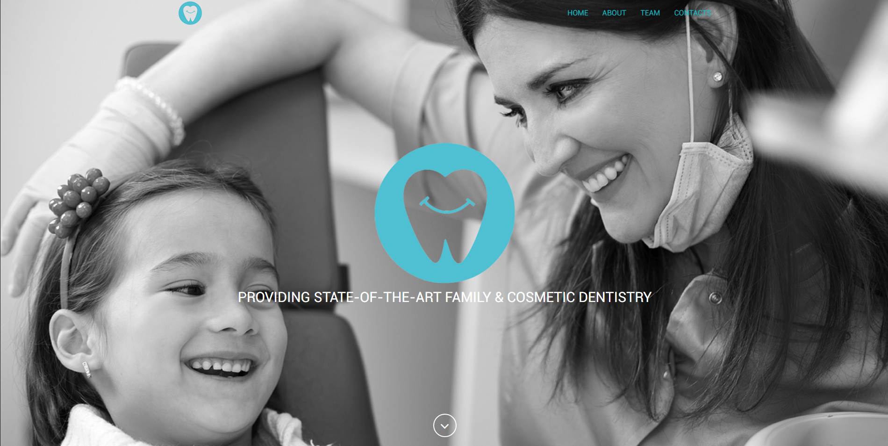

# Theme Dentistality

<!-- BADGES/ -->

  

  

 

  

  

  

  

  

  

 

  

  

  

<!-- /BADGES -->

## Details

### Dental Clinic Purpose One Page Theme

Dentistality is a clean, professional, responsive Bootstrap template. With one unique page sample to get you started about dental clinic theme, this theme is perfect for a wide range of business types.

The Template includes a dedicated folder for the Image Source and for the Assets.

### Feature List

- Include 12 Months of support by CalliTech.

### Project Information

##### Test Page

Please visit our [Test Page](http://theme-dentistality.calli.tech/) and see the project working:

  

##### Documentation

Please visit our [Documentation Page](http://theme-dentistality.calli.tech/docs/documentation.html) if you need any help.

##### Date

23/04/2016

##### Authors

Francisco Maria Calisto ([FMCalisto](https://github.com/FMCalisto))

##### Keywords

dentist, clinical, medic, template, business, card, office, clinic, hospital, dr., doctor, surgery, cosmetic, family, services

#### License

For more details about our License agreement please read the [LICENSE](https://github.com/CalliTechDev/theme-dentistality/blob/master/LICENSE.md).
